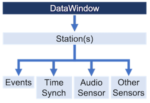

# DataWindow Parameters



In this example, we will go over all the parameters you can pass into DataWindow to customize the result.

DataWindow has several parameters, with many of them utilizing default values in order to provide a convenient
experience.  We will explain each of these parameters, as well as provide sample code that demonstrates their use.

> **_Please note:_**
> 
> Many of the parameters listed here are optional and have default values if you do not set them.
> 
> We recommend to set only the parameters you need and to rely on the default values otherwise.
> See [Simplified DataWindow with Parameters](#simplified-datawindow-with-parameters) 
> for an example.

## DataWindow

DataWindow has 7 parameters.  We recommend you set at least the `event_name` and `config` parameters.
Refer to the [documentation](https://github.com/RedVoxInc/redvox-python-sdk/tree/master/docs/python_sdk/data_window#strongly-recommended-datawindow-parameters) 
for more information about the parameters.

1. `event_name`: A string describing the event of interest and is used to identify the DataWindow.
2. `event_origin`: An EventOrigin object describing the physical location of the event of interest.
3. `config`: A DataWindowConfig object which sets the search parameters of the DataWindow.
4. `output_dir`: The directory where the DataWindow will be saved, if the function is invoked.
5. `out_type`: A string denoting the output type when saving DataWindow.  Valid values are: `"NONE"` (no saving), 
   `"LZ4"` (save using lz4 compressed file), and `"PARQUET"` (save using parquet files).
6. `make_runme`: A boolean that denotes if a special `runme.py` file is included when saving the DataWindow.
7. `debug`: A boolean that denotes if extra information will be printed to the screen during runtime.

The following example shows the parameters and their default values. 

```python
from redvox.common.data_window import DataWindow

# WARNING: this code will not produce any meaningful results and is for demonstration only

# Create the DataWindow
dw = DataWindow(event_name="dw",
                event_origin = None,
                config = None,
                output_dir = ".",
                out_type = "NONE",
                make_runme = False,
                debug = False)
```

## EventOrigin

EventOrigin is used to describe the physical location of an event of interest.  It has 8 parameters.
Refer to the [documentation](https://github.com/RedVoxInc/redvox-python-sdk/tree/master/docs/python_sdk/data_window#event-origin)
for more information about the parameters.

1. `provider`: A string describing the source of the location information.
2. `lat`: A float value of the event's latitude in +/- degrees.
3. `lat_std`: A float value of the latitude's standard deviation.
4. `lon`: A float value of the event's longitude in +/- degrees.
5. `lon_std`: A float value of the longitude's standard deviation.
6. `alt`: A float value of the event's altitude in +/- degrees.
7. `alt_std`: A float value of the altitude's standard deviation.
8. `event_radius_m`: A float value of the event's radius in meters.

The following example shows the parameters and their default values.

```python
import numpy as np
from redvox.common.data_window import EventOrigin

# create the EventOrigin
eo = EventOrigin(provider = "UNKNOWN",
                 lat = np.nan,
                 lat_std = np.nan,
                 lon = np.nan,
                 lon_std = np.nan,
                 alt = np.nan,
                 alt_std = np.nan,
                 event_radius_m = 0.0)
```

## DataWindowConfig

DataWindowConfig is used to set the search parameters of DataWindow.  It has 13 parameters, one of which is required to 
be set.  Refer to the [documentation](https://github.com/RedVoxInc/redvox-python-sdk/tree/master/docs/python_sdk/data_window#datawindowconfig)
for more information about the parameters.  We also recommend you take notice of the format of your data's directory 
when setting the `structured_layout` parameter.

1. `input_dir`: The directory that contains all the data.  REQUIRED
2. `structured_layout`: A boolean that denotes if the `input_dir` contains specially named and organized directories of 
   data.  Read more about the structured layout [here](https://github.com/RedVoxInc/redvox-api-1000/blob/master/docs/standards/filenames_and_directory_structures.md#standard-directory-structure).
3. `start_datetime`: A datetime of the inclusive starting datetime of the window.  If not included, uses the first 
   timestamp of the data.
4. `end_datetime`: A datetime of the non-inclusive ending datetime of the window.  If not included, uses the last 
   timestamp of the data.
5. `start_buffer_td`: A timedelta of the amount of time to include before the `start_datetime` when filtering data.
   Negative values are converted to 0.
6. `end_buffer_td`: A timedelta of the amount of time to include after the `end_datetime` when filtering data.
   Negative values are converted to 0.
7. `drop_time_s`: A float of the minimum amount of seconds between data files that would indicate a gap.
   Negative values are converted the default value.
8. `station_ids`: A set of strings representing the station ids to filter on.  If not included or an empty set, gets 
   all station ids it can find.
9. `extensions`: A set of strings representing file extensions to filter on. If not included, gets all redvox files it 
   can find.
10. `api_versions`: A set of ApiVersions representing api versions to filter on.  If not included, gets as much data as 
    it can in the input directory.
11. `apply_correction`: A boolean that denotes if the data's timestamps will be updated automatically.
12. `use_model_correction`: A boolean that denotes which offset value is used to apply corrections.
13. `copy_edge_points`: A DataPointCreationMode value which determines how new points are created.  Valid values are 
    `NAN`, `COPY`, and `INTERPOLATE`.

The following example shows the parameters and their default values.

```python
from redvox.common.data_window import (
    DataWindowConfig, 
    DEFAULT_START_BUFFER_TD,  # timedelta(minutes=2.0)
    DEFAULT_END_BUFFER_TD,    # timedelta(minutes=2.0)
    DATA_DROP_DURATION_S      # 0.2
)
import redvox.common.gap_and_pad_utils as gpu

# Input Directory
input_dir = "path/to/redvox/data"
# for Windows, delete the above line and use the line below instead:
# input_dir: str = "C:\\path\\to\\redvox\\data

# create the DataWindowConfig
dw_cfg = DataWindowConfig(input_dir = input_dir,
                          structured_layout = True,
                          start_datetime = None,
                          end_datetime = None,
                          start_buffer_td = DEFAULT_START_BUFFER_TD,
                          end_buffer_td = DEFAULT_END_BUFFER_TD,
                          drop_time_s = DATA_DROP_DURATION_S,
                          station_ids = None,
                          extensions = None,
                          api_versions = None,
                          apply_correction = True,
                          use_model_correction = True,
                          copy_edge_points = gpu.DataPointCreationMode.COPY)
```

## DataWindow with All Parameters

Let's put everything together.  Remember to change any values as needed.

```python
import numpy as np
from redvox.common.data_window import (
    DataWindow,
    EventOrigin,
    DataWindowConfig, 
    DEFAULT_START_BUFFER_TD,  # timedelta(minutes=2.0)
    DEFAULT_END_BUFFER_TD,    # timedelta(minutes=2.0)
    DATA_DROP_DURATION_S      # 0.2
)
import redvox.common.gap_and_pad_utils as gpu 

# create the EventOrigin
eo = EventOrigin(provider = "UNKNOWN",
                 lat = np.nan,
                 lat_std = np.nan,
                 lon = np.nan,
                 lon_std = np.nan,
                 alt = np.nan,
                 alt_std = np.nan,
                 event_radius_m = 0.0)

# Input Directory
input_dir = "path/to/redvox/data"
# for Windows, delete the above line and use the line below instead:
# input_dir: str = "C:\\path\\to\\redvox\\data

# create the DataWindowConfig
dw_cfg = DataWindowConfig(input_dir = input_dir,
                          structured_layout = True,
                          start_datetime = None,
                          end_datetime = None,
                          start_buffer_td = DEFAULT_START_BUFFER_TD,
                          end_buffer_td = DEFAULT_END_BUFFER_TD,
                          drop_time_s = DATA_DROP_DURATION_S,
                          station_ids = None,
                          extensions = None,
                          api_versions = None,
                          apply_correction = True,
                          use_model_correction = True,
                          copy_edge_points = gpu.DataPointCreationMode.COPY)

# Create the DataWindow
dw = DataWindow(event_name="dw",
                event_origin = eo,  # do not change this line
                config = dw_cfg,    # do not change this line
                output_dir = ".",
                out_type = "NONE",  # use PARQUET for .parquet files and LZ4 for one compressed file
                make_runme = False,
                debug = False)
```

## Simplified DataWindow with Parameters

Here is a shorter example which sets commonly used parameters and relies on the defaults for the others. 
Update the values to match your needs and environment.

```python
from redvox.common.data_window import DataWindowConfig, DataWindow
import redvox.common.date_time_utils as dt

# Variables
input_dir: str = "/path/to/redvox/data"
# for Windows, delete the above line and use the line below instead:
# input_dir: str = "C:\\path\\to\\redvox\\data
station_ids = ["list", "of", "ids"]
start_timestamp_s: dt.datetime = dt.datetime_from(start_year,
                                                  start_month,
                                                  start_day,
                                                  start_hour,
                                                  start_minute,
                                                  start_second)
end_timestamp_s: dt.datetime = dt.datetime_from(end_year,
                                                end_month,
                                                end_day,
                                                end_hour,
                                                end_minute,
                                                end_second)
structured_layout: bool = True_or_False
# End Variables

config = DataWindowConfig(input_dir=input_dir,
                          structured_layout=structured_layout,
                          start_datetime=start_timestamp_s,
                          end_datetime=end_timestamp_s,
                          station_ids=station_ids)

datawindow = DataWindow(event_name="example_dw",
                        config=config)
```

Now that you have a DataWindow, we will demonstrate how to [access the metadata](01_data_window_metadata.md) in the 
next section.
