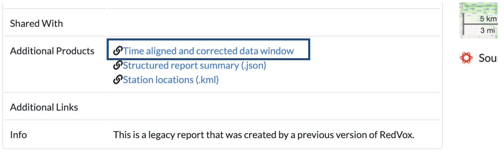

# Getting Started

## Python setup

You will need the [RedVox SDK](https://github.com/RedVoxInc/redvox-python-sdk#redvox-python-sdk). 
The SDK can be installed by running:
```shell
pip install redvox
```
in a terminal with Python enabled.

For more instructions on installing this library, please visit
[RedVox SDK Installation](https://github.com/RedVoxInc/redvox-python-sdk/blob/master/docs/python_sdk/installation.md#-redvox-sdk-installation)

You can confirm everything is installed correctly by running this Python script:
```python
import redvox

if __name__ == "__main__":
    print("Redvox version: ", redvox.version())
```
If there are no errors, you will see the version number printed to the screen.

## Obtaining Data

Data can be obtained as raw data or in a pre-constructed DataWindow.

The raw data comes in specially formatted files with one of the following extensions: `.rdvxz` or `.rdvxm`.

A pre-constructed DataWindow is either a compressed file, a compressed directory, an uncompressed directory with two 
files or an uncompressed directory with one file and one or more sub-directories in it.

This section will briefly cover the various methods of obtaining data, as well as the type of data you are obtaining.

> **_NOTE:_** Later examples assume you are using raw data in a structured directory on your computer to create 
> DataWindow.  If you are using a different method, update the example code accordingly.

### Reports on the Redvox Website

The fastest method is to use the [redvox website](https://redvox.io) and download a DataWindow from a report.

We will be using a dataset recorded during a SpaceX launch. The data is located in the RedVox report:
[https://redvox.io/#/reports/E328](https://redvox.io/#/reports/E328)

In _Additional Products_, click the `Time aligned and corrected data window` link.



A file named `dw_1648830257000498_2.pkl.lz4` will start to download.

### Command Line Interface

Use the [cloud-download](https://github.com/RedVoxInc/redvox-python-sdk/tree/master/docs/python_sdk/cli#cloud-download-command-details)
or the [data-req](https://github.com/RedVoxInc/redvox-python-sdk/tree/master/docs/python_sdk/cli#data-req-command-details) 
command to download data using the Command Line Interface (CLI).

Refer to the [Documentation for the CLI](https://github.com/RedVoxInc/redvox-python-sdk/tree/master/docs/python_sdk/cli)
for more information about using it to get data.

### Copy the Files onto Your Computer

Use your preferred method of saving the files from a recording device or other computer onto your computer.  The exact 
method will vary based on the combination of device and OS.  We assume you are knowledgeable about this process.

Now that you have your data, we will [briefly explain DataWindow](what_is_data_window.md).
