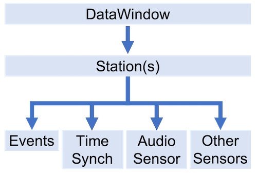

# What is DataWindow

* A DataWindow is a format-agnostic, refined aggregation of raw data files that is designed to provide the most complete 
  set of data it can find to the user as efficiently as possible.

* A DataWindow is often created to highlight a single event.  The event can be anything that creates sound, and must 
  occur some time between the start and end times of the DataWindow.

* A DataWindow is intended to contain one or more Stations, with each Station containing one or more Sensors.  Stations 
  are expected to at least have an Audio Sensor.  While it is possible for DataWindow to have 0 Stations, such a 
  DataWindow is uninteresting and is recommended to be discarded.  Below is a diagram describing this layout:

* DataWindow uses default values for many of its properties, so it can be created using only the raw data files.  We 
  recommend that you set several of the properties in order to produce a higher-quality result.

* DataWindow introduces small margins of error into the data during the aggregation process.  The error is introduced 
  due to methods that streamline the data for processing and presentation.  The margin of error varies slightly with 
  the specific dataset being used to create the DataWindow, but is typically less than 1%.  If you are interested in 
  the raw data, refer to the page on the 
  [low-level API](https://github.com/RedVoxInc/redvox-python-sdk/blob/master/docs/python_sdk/low_level_api.md)
  for methods on how to extract it from the data packets.

Now that you have a brief overview of DataWindow, let's look at its [creation parameters](00_create_data_window.md).

You can read more about DataWindow [here](https://github.com/RedVoxInc/redvox-python-sdk/tree/master/docs/python_sdk/data_window#datawindow).